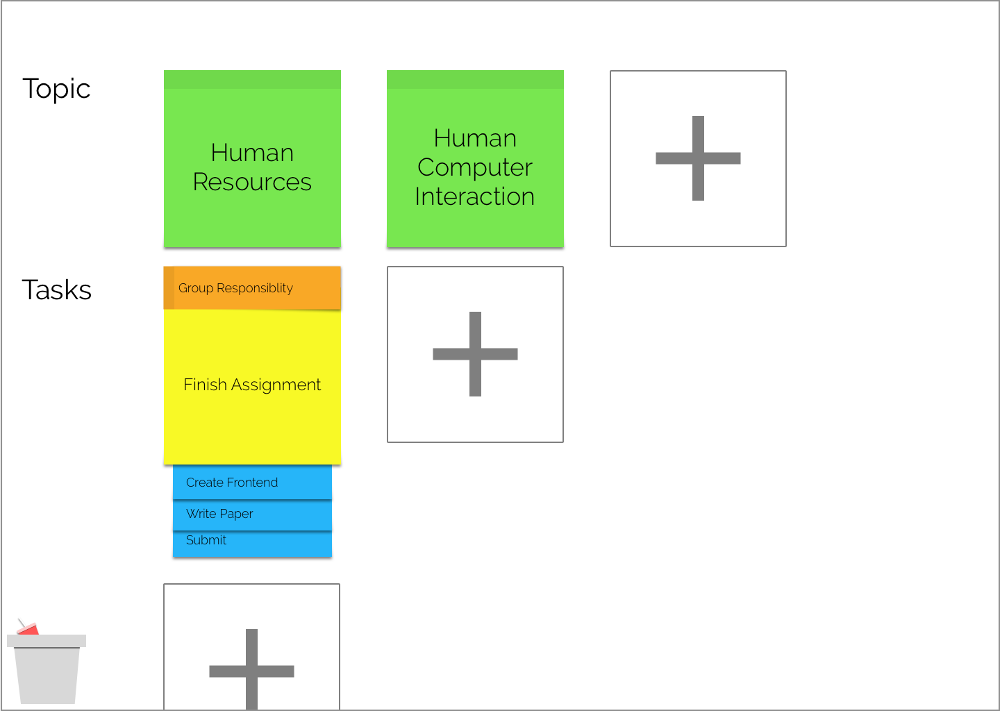

# Stick2It


Stick2It is a personal task manager to help the user keep track of their goals, in a simple and intuitive way. 

The app is currently in progress. To view the current progress and run the app view the [alpha version online](http://www.nickmorrison.me/organizer) or clone the repository and use ```npm install``` to run.
